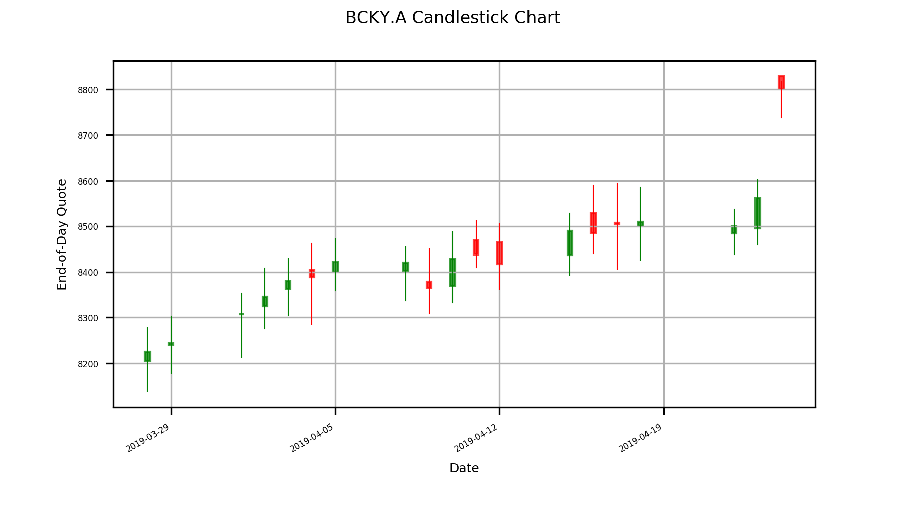
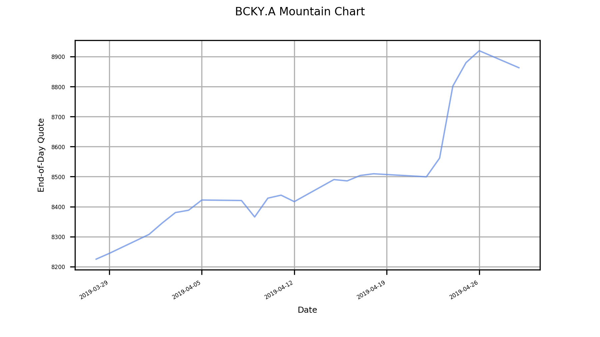
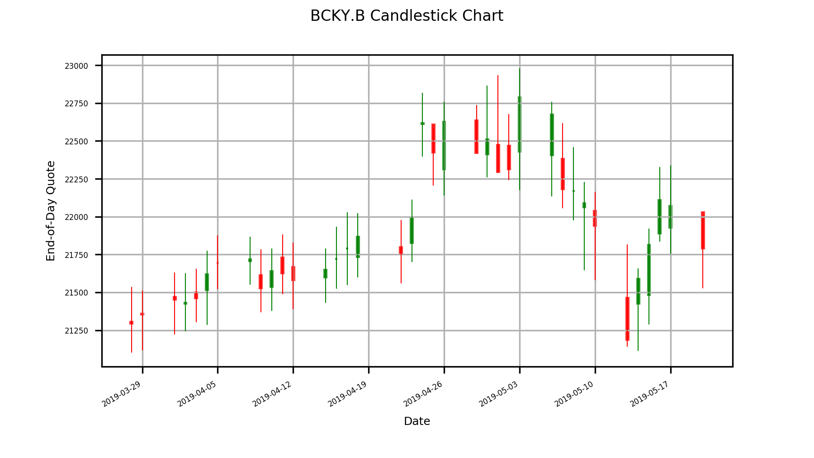
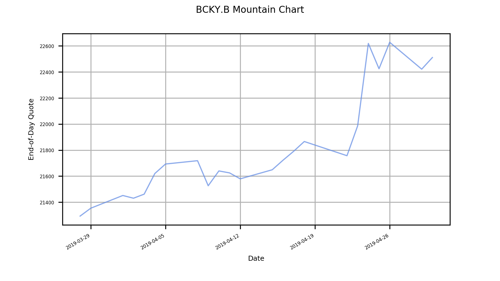
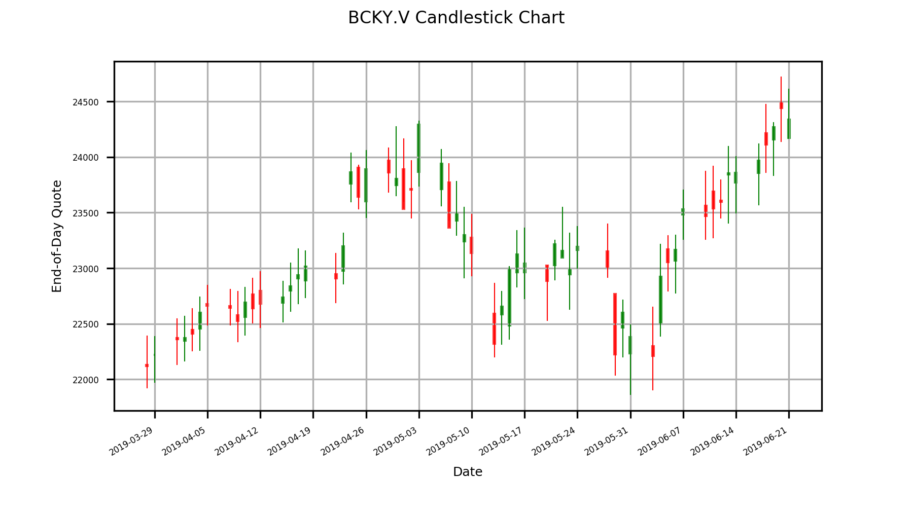
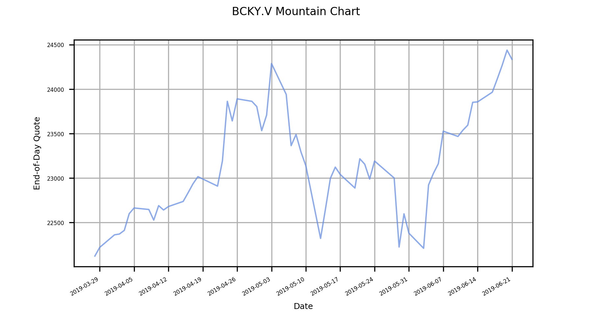
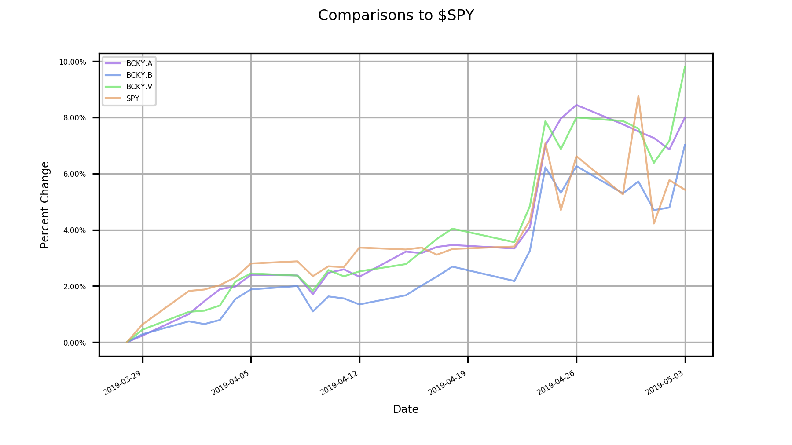

# ^BCKY
## _everyone's favorite index fund from r/WallStreetBets, after $SPY_

This project is based on [this reddit post](https://www.reddit.com/r/wallstreetbets/comments/b6mudk/bcky_update_wsb_was_right_diversification_bad/) by [u/motorboatbwbwb](https://www.reddit.com/user/motorboatbwbwb), which is an updated version of [this post](https://www.reddit.com/r/wallstreetbets/comments/b6hvdf/i_indexed_beckys_portfolio_so_you_dont_have_to/), which is preceded by [this post from r/investing](https://www.reddit.com/r/investing/comments/9n31xf/introducing_the_white_girl_index/), which refers to [this comment](https://www.reddit.com/r/investing/comments/9mvabs/bill_ackman_reveals_900_million_bet_on_starbucks/e7htx2q) about [this news article](https://www.cnbc.com/2018/10/09/bill-ackmans-pershing-reveals-stake-in-starbucks.html).

\[I'll polish the description here later\]

There are 3 indices in this repository.

### ^BCKY.A

^BCKY.A tracks the fewest stocks. It uses the composition from [this post](https://www.reddit.com/r/wallstreetbets/comments/b6hvdf/i_indexed_beckys_portfolio_so_you_dont_have_to/).

component|weight
---------|------
AAPL|5
ETSY|15
LULU|6
MC|3
OR|4
PLNT|15
SBUX|14
ULTA|3

### ^BCKY.B

^BCKY.B is a much longer, and possibly over-done extension to ^BCKY.A. It uses the composition from [this post](https://www.reddit.com/r/wallstreetbets/comments/b6mudk/bcky_update_wsb_was_right_diversification_bad/). In addition to what is in ^BCKY.A, it has the following components:

component|weight
---------|------
COTY|87
DECK|7
DEO|6
EL|6
LB|36
FIZZ|18
NFLX|3
NKE|12
SNAP|93
TGT|12
TIF|18
UAA|47
VFC|11

### ^BCKY.V

^BCKY.V uses the composition from that [r/investing post](https://www.reddit.com/r/investing/comments/9n31xf/introducing_the_white_girl_index/)

component|weight
---------|------
AAPL|5
DECK|7
DIS|9
EL|6
FB|6
LB|36
LULU|6
NKE|12
SBUX|14
UAA|47
ULTA|3
ADDYY|8
DEO|6
LRLCY|19
LVMUY|14
ETSY|15
FIZZ|18
GOOS|21
NFLX|3
SNAP|93
TGT|12
TIF|10

### charts















### caveats

My code stinks. Think quadruple times before you bet all your money on ^BCKY. 

I haven't figured out how to take market holidays off the x-axis. Please help me if you know how. 

The stocks for MC and OR I use in the portfolios are $LVMHF and $LRLCF instead of $MC.PA and $OR.PA because I'm too lazy to do currency conversions, although it is quite simple to get the exchange reate from IEX. 

This thing doesn't handle stock splits and portfolio rebalances, yet. I kinda have an idea of how it might be done, but I'm too lazy to do it for now. Luckily none of the companies in the portfolios have splits anytime soon as far as I know.

For all the candlestick charts, the open and close quotes are accurates, but the highs and lows are absolutely not. The highs and lows reflect the highest possible highs and lowest possible lows. To get accurate highs and lows, I would need tick data, but that would exhaust my free IEX accoun's message quota quite quickly. I don't even know if I have enough quota for one day's tick data.

There are more caveats, but I can't remember right now. I'm too tired.

### weighting

[I need to think of a backronym for AUTISM first]

### build/play with the code

Just clone it and run ./update

```bash
git clone https://github.com/zvooz/-BCKY.git
cd -BCKY
./update
```
Data provided for free by [IEX Cloud](https://iexcloud.io/)

<a href="http://www.wtfpl.net/"></a>
